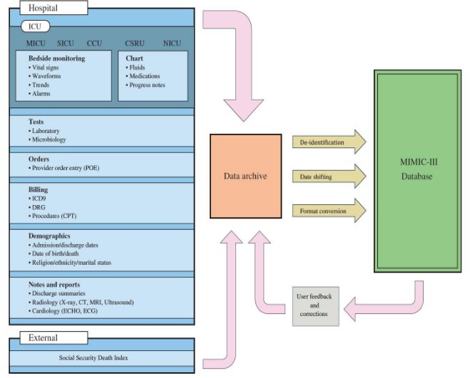
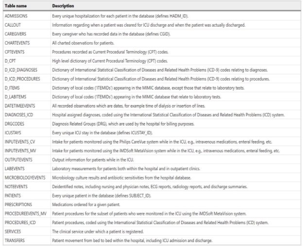
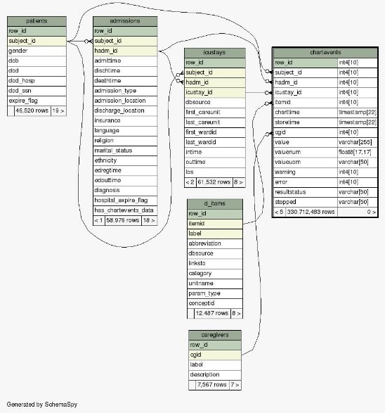
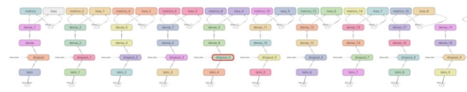
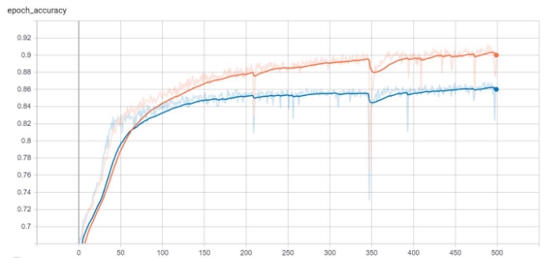
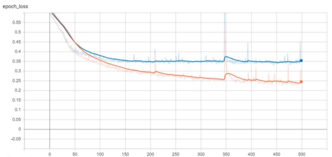
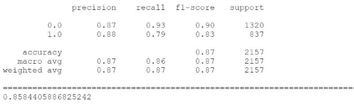


**1   Introduction**

Critical care has been first step for emergency/acute diseases in the hospitals. Understanding and improving critical care in the hospital has been a topic of concern where science can improve the result and might prevent the  possible  fatalities.  The  data  collected  in  hospitals  critical  care  unit  includes  medications,  laboratory measurements, vital signs, and observation and notes by care takers. With the help of database – MIMIC III (Medical Information Mart for Intensive Care) [1]. we will be predicting mortality of patient admitted and diagnosed  at  the  hospital  for  24  hours.  The  MIMIC  database  is  deidentified  single-center  database  for comprehensive clinical data of patients admitted at the Beth Israel Deacones Medical Center in Boston Massachusetts. The database consists of larger (~ 6 GB) of clinical records and widely accessible to research.  

The death of admitted critical care patients depend in various factors such as age, diagnosis, care, and previous medical history. The database comprises of numerous such attributes to research on improving clinical practice. In this project, we are trying to extract and analyze principal components of las 24 hours, which plays vital role to predict mortality of patients admitted at the hospital. We will experiment on sequence neural network model.  Since we have large dataset, we need to perform data and feature engineering before using any kind Neural Network, because for most of neural networks map the input vector to output in supervised setting. We have followed the SAPII [2] severity score guideline to identify principal medical lab measurements to train our model. 

Our problem is temporal in nature. We will be predicting the mortality based on time and other factors. Since there are various types of neural network and choosing right one is crucial for any prediction task. We find a modified recurrent network called LSTM (Long Short-Term Memory) that helps to eliminate the problems encountered in recurrent neural network. LSTM is proven to be best model for temporal forecasting.  

**2  High Level Approach**  

Theoretically there is no certain rules to address most of the problems in machine learning. We have chosen best practice for our task, and it is an iterative approach. 

*Fig 1 Flow Chart* 

This figure illustrates the process of this project. First, we collected data from source and preprocessed, analyzed, modelling, and evaluation. The MIMIC III data are noisy and poorly structured. Our majority of time were invested on our data extraction, preprocessing to feed into the model. We have used sequence model based on time domain; this made our task little fun to do. We will discuss the detail following sections 

**3  Data Engineering** 

1. **Data Description** 

In our project we have used our data from the MIMIC-III database which is freely available database. MIMIC- III incorporates deidentified clinical data of 42,000 patients admitted to Beth Israel Deaconess Medical center in Boston, Massachusetts, and is freely available to the researchers worldwide under a data use agreement. The accessible nature of the data enables the replication and enhancement or clinical trials in ways which would not otherwise possible. 

*Fig 2 MIMICIII data attributes* 

The MIMIC-III critical care database is unique and notable for following reasons: 

- Publicly available clinical database. 
- Spans more than a decade and detailed information on patients. 
- Unlimited research once signed agreement. 

MIMIC-III dataset contains many collections of tables each representing specific purpose and can be joined using SQL queries by use of linked identifiers such as suffix ‘ID’ for example, SUBJECT\_ID refers to a unique patient, HADM\_ID refers to a unique admission to the hospital, and ICUSTAY\_ID refers to a unique admission to an intensive care. 

Different tables have their own use such as admissions; patients; ICU stays; chart events; and items, and transfers are used to define, and track patient stays. Another five tables are cross referencing codes against their respective  definitions:  D\_CPT;  D\_ICD\_DIAGONSESD\_ITMES;  D\_LABITEMS.  The  remaining  tables contain data associated with patient care, such as physiological measurements, caregiver observations and billing information. 

*Fig 3 MIMICIII data description* 

2. **Data extraction**  

For any machine learning problem, data is the fuel. To complete the project, we acquired data from Pyhsionet [3]** which is licensed data for reproducible research. MIMIC III dataset consists of vast array of patients’ information. Since we cannot use every entity for our model due to resource limitation and some are not relevant. We have 46 thousand patients, 58 thousand hospital admissions, and 116 million plus ICU chart events. we carefully queried the data on MIMIC III database to get required feature. 

[*Fig 4 used entities, attributes, and their relationships ](https://mit-lcp.github.io/mimic-schema-spy/tables/chartevents.html)* 

These datasets are considered with the meticulous guidelines of SAPII severity score. We manually picked event items – medical measurement such as heart rate, temperature etc., as our features. We took inner join from patients and admissions entities, then only picked patients who are admitted to ICU unit. We found that the class was imbalanced i.e., vast difference among the number of people died and number of people lived. To address that issue, we picked random live patients just above the dead number of patients. We took total of 14 thousand distinct hospital admissions and inner joined them with chart event data. But we remove all the null chart values from our entries. We collected 242 thousand of chart events with respect to hospital admission. 

*Fig 5 Selected features*  

Many chart events were having a null value, and that will not help us while training our neural network. We decided to remove such null values. Finally, we exported data to .csv files for further actions. We will discuss more data in data preparation section. 

3. **Data Preparation** 

At this stage, we loaded our extracted data files preprocessed. We imputed null chart values with zero, which is safe in neural network. One of the challenging tasks was to convert the into time variant. We needed the data for last 24 hour of ICU stays. The data is required od both classes i.e., dead, and live. We decided to pick ICU discharge date and time if a person has lived, otherwise death date and time. We dropped the variables such as admission ID, and date time variables after preparing time variant data. 

*Fig 6 Data Preparation flow chart* 

The figure 6 shows the data preparation process for last 24 hours of an individual hospital admission. Here we can have multiple admissions of person, and we consider this as well. In total, we took 6536 distinct hospital admissions and their corresponding chart event details and vital statistics. We prepared (6536, 24, 19) - (instances, time lag, features) shaped data for our neural network. 

**4  Model** 

For this task, we have chosen modified version of recurrent neural network know as long short-term memory. The LSTM neural network can handle good number of sequences of input. We have transformed our feature in to 24 different timestamps as they represent the vital measurements of a patient in ICU chart events. The key points we considered while choosing LSTM are: 

- To deal with variable-length sequences 
- We need to maintain sequence order 
- To keep track of long-term dependencies 
- And to share parameters across the sequence. 

An obvious network architecture would be RNN (recurrent neural network) when it comes to sequence model. RNN are distinguished as, hidden layers retaining its state while processing the next step in the sequence of inputs. The diagram below shows that each hidden unit takes in input its own previous state and new input at that time step. In this type of networks parameters remains same throughout the sequence, this solves the problem of parameter sharing. This also solves problem of long-term dependencies because the cell state in future encompasses all the information of previous cell state. 

*Fig 7 Recurrent Network Architecture*  

Training of RNN happens through back propagation, and in backpropagation we tend to find parameters that minimizes the loss function this is done by taking derivative of the loss with respect to each of the parameters and then shifting the parameters in the opposite direction to try and minimize the loss this process is called gradient descent. The problem with RNN is that since we have output at every time step, we have loss at every time step, and as the gap between the time steps gets bigger and bigger the product gets longer.  

1. **Long Short-Term Memory**  

The LSTM architecture was motivated to improve upon the RNN flaw i.e., backpropagated error either explodes or vanishes exponentially. The LSTM comprises of multiple memory cells or blocks. Each LSTM cell comprises of four units – the input, output, update, and the forget gates.  

*Fig 8 Our LSTM high level architecture* 

*Fig 9 fig 8 Legends* 

Our network has 10 lstm units, accepts 24 timestamped data, and 19 feature variables. We have added 0.1 dropout – this helps to loose information, as we have few noise in data; and final single node to classify our final output.  

*Fig 9 One LSTM Unit Structure*** 

On this network, each LSTM cell receives (1,19) matrix and outputs probability for the current cell and history for the next cell. This process goes until 24th LSTM cell and final classification probability will be outputted for entire sequence. In addition, each layer has their own error – measured using binary cross entropy loss and receives error from preceding cells while backpropagation. In this network, we have used sigmoid as an activation function. Since our classification is binary, and sigmoid function produces probability to classify. 

2. **Model Training**  

In model training, we set hyperparameters for our training, such as number of epochs, batch size – number instance at once, optimizer, and loss measurement. In our model we have used adam as optimizer with learning rate 0.001, batch size 100, and epochs 500. We do not have cookbook to set these hyperparameters for any neural network, but we need to trail  and error  or grid search on hyperparameter range. We  have used TensorFlow as our deep learning package. The implementation of LSTM in TensorFlow has glorot uniform – samples weights from random uniform distribution, distribution for LSTM kernel initialization. 

Train Validation 

*Fig 10 Training and Validation accuracy*** 

Train Validation 

*Fig 11 Training and Validation loss*** 

3. **Model evaluation** 

In our experiment, we have analyzed 6536 ICU stay patients with their demographic information, and vital measurements recorded. We classified whether the patient has died in hospital or successfully discharged. LSTM is used to classify theses patients with sigmoid value – probability to die or live. Binary cross entropy is our loss metrics measurement, also known as log loss function. 

1

( ) = − ∑ ⋅ ( ( )) + (1 − ) ⋅ (1 − ( )) 

=1

Where  is the label (1 for died 0 for lived) and  ( ) is the predicted probability of the point being died for all  data points. Conversely,  (1 − ( )) is the log probability of it being lived for each lived point  = 0. 

The outputs of classifiers can be summarized in four groups: the patients who are truly diagnosed as died (TP), the people who are incorrectly labeled as died (FP), the records correctly detected as information belonging to survived patients (TN), and finally the ones incorrectly assigned as living patients (FN). These four groups can be aggregated in different ways. 

- +
- +

In this experiment, we have similar precision and recall scores. The harmonic average of precision and recall known as  1 − is also considered. 

2(  ∗ ) 1 − = 

\+

We tried to compare other state of the art machine learning models for similar task. Table 1 shows the above- mentioned scores. 

**Classifier  Precision  Recall   F1 – score **

K-NN  **0.80  0.85  0.82** Logistic Regression  **0.77  0.67  0.72** Linear SVM  **0.80  0.63  0.70** Boosted Trees  **0.91  0.83  0.87** LSTM  **0.86  0.85  0.85** 

*Table 1 classification Result for ICU mortality* 

As shown in Table 1, other models do not have major difference among precision, recall, and F1-score results, which is imbalance data. Our LSTM has almost exact metrices.  

*Fig 11 LSTM classification report* 

*Fig 12 heatmap for confusion matrix* 

We have implemented recurrent neural network called LSTM, which mostly thought as black box and hard to interpret how it produces result. This is just a mapping between given input and output to find pattern among data, and further used for similar data to infer. However, in practice, it is hard to use such black box tool for critical decision making. The result should be interpretable, transparent, and capable of integrating clinical background knowledge into analysis. 

**5  Conclusion and Future Work** 

Early identification of mortality in ICU is critical due to dire accurate medical decision. In this project we took various health measurements which are critical for a patient into considerations. We have limit medical facility, and professional to make quick and accurate decisions to prevent fatality. We demonstrated the statistical capability to interpret and predict the possible event at ICU. 

This work has limited scope in terms of what could be achieved. MIMIC III is very rich clinical database and demands data engineering and prediction tasks. In our work we have incorporated limited features as compared to available dataset. In future work, more detailed data can be employed to make more interpretable as well as accurate predictions. The prediction can be done using entire ICU stay data for a month, semester or even a year. Finally, we plan to further extend this task more robust in real time setting integrated with hospital settings. 

**6  Acknowledgement**  

This works is based on MIMIC III database to fulfil the requirement of ENIN 880 CA project at university of Regina. The experiments, findings and conclusions are expressed based on authors work and does not depicts the view of MIMIC III. We would like to thank Dr. Rene Mayorga for his guidance and this opportunity. 

7  **References**

1. MIMIC III. (n.d.). Retrieved December 01, 2020, from https://mimic.physionet.org/gettingstarted/access/ 
1. Simplified Acute Physiology Score (SAPS) II. (n.d.). Retrieved December 12, 2020, from https://www.mdcalc.com/simplified-acute-physiology-score-saps-ii 
1. The Laboratory for Computational Physiology, M. (n.d.). MIMIC Critical Care Database. Retrieved December 02, 2020, from https://mimic.physionet.org/ 
4. Sadeghi, R., Banerjee, T., & Romine, W. (2018). Early hospital mortality prediction using vital signals. *Smart Health,* *9-10*, 265-274. doi:10.1016/j.smhl.2018.07.001 
